**English** | [简体中文](README.md)

<picture>
  <source media="(max-width: 640px) and (prefers-color-scheme: dark)" srcset="assets/presentation/hero-mobile-dark.svg">
  <source media="(max-width: 640px)" srcset="assets/presentation/hero-mobile-light.svg">
  <source media="(prefers-color-scheme: dark)" srcset="assets/presentation/hero-dark.svg">
  
</picture>

**Plant local hostname and fake-credential decoys, record touches with DNS/TCP sensors and produce verifiable reports.**

`v0.9.0` · `Python 3.12+` · [Apache-2.0](LICENSE)

[Website](https://canaryprobe.lei6393.com) · [Demo record](docs/demo-results.json)

## Why use it

When an agent’s internals are unavailable, a decoy gives operators a concrete observation point: did a request touch a planted value? CanaryProbe records the source, timestamp and sensor type locally so operators can interpret the event in its deployment context.

## Architecture

<picture>
  <source media="(max-width: 640px) and (prefers-color-scheme: dark)" srcset="assets/presentation/architecture-mobile-dark.svg">
  <source media="(max-width: 640px)" srcset="assets/presentation/architecture-mobile-light.svg">
  <source media="(prefers-color-scheme: dark)" srcset="assets/presentation/architecture-dark.svg">
  
</picture>

init creates decoys, deployment configuration and an HMAC manifest. watch runs authoritative DNS and TCP sensors in one process and appends events to audit.jsonl. report reads events and the manifest to produce HMAC-signed Markdown; verify recomputes signatures using the deployment key.

Source entry points: [canaryprobe/cli.py](canaryprobe/cli.py) · [canaryprobe/config.py](canaryprobe/config.py) · [canaryprobe/sensor_dns.py](canaryprobe/sensor_dns.py) · [canaryprobe/sensor_conn.py](canaryprobe/sensor_conn.py) · [canaryprobe/decoy.py](canaryprobe/decoy.py) · [canaryprobe/report.py](canaryprobe/report.py) · [examples/local-agent-demo.md](examples/local-agent-demo.md)

## Install

Requires Python 3.12+ and uv. The example binds a temporary loopback UDP port without root and does not change system DNS or hosts.

```bash
git clone https://github.com/SuperMarioYL/canaryprobe.git
cd canaryprobe
uv venv --python 3.12
uv pip install --python .venv/bin/python -e .
```

## Quickstart

The script plants temporary decoys, sends one query to a real local DNS sensor and verifies the report and manifest. It launches no coding agent and tests no external network. Generated hostnames, ports and timestamps vary between runs.

```bash
.venv/bin/python examples/presentation-demo.py
```

Complete inputs and execution steps are included in the commands above and the [demo record](docs/demo-results.json).

## Usage

```bash
.venv/bin/canaryprobe init --dir ./deployment
.venv/bin/canaryprobe watch --dir ./deployment --duration 60
.venv/bin/canaryprobe report --dir ./deployment
.venv/bin/canaryprobe verify --dir ./deployment
```
While watch runs, use `simulate-trip --dir ./deployment --sensor dns` or `--sensor conn` in another terminal. plant aliases init. `--output` selects the report path and verify accepts `--report`.

## Recorded demo

<picture>
  <source media="(max-width: 640px) and (prefers-color-scheme: dark)" srcset="assets/presentation/process-mobile-dark.svg">
  <source media="(max-width: 640px)" srcset="assets/presentation/process-mobile-light.svg">
  <source media="(prefers-color-scheme: dark)" srcset="assets/presentation/process-dark.svg">
  
</picture>

### Trip and verify

DNS returns a loopback address. The report contains one event, and both manifest and report signatures verify.

```text
$ .venv/bin/python examples/presentation-demo.py
Request: [127.0.0.1:63137] (udp) / 'ci-runner-07-91.corp.local.' (A)
Reply: [127.0.0.1:63137] (udp) / 'ci-runner-07-91.corp.local.' (A) / RRs: A
{
  "dns_answer": "127.0.0.1",
  "verdict": "TRIPPED",
  "events": 1,
  "manifest_verified": true,
  "report_verified": true
}
```

## Capabilities and integration

<picture>
  <source media="(max-width: 640px) and (prefers-color-scheme: dark)" srcset="assets/presentation/integrations-mobile-dark.svg">
  <source media="(max-width: 640px)" srcset="assets/presentation/integrations-mobile-light.svg">
  <source media="(prefers-color-scheme: dark)" srcset="assets/presentation/integrations-dark.svg">
  
</picture>

Default binds are 127.0.0.1:5353 for DNS and 127.0.0.1:5443 for TCP. Tested traffic must reach those listeners; editing /etc/hosts alone does not route DNS queries to port 5353.


## Configuration

deployment.yaml owns `decoy_zone`, `dns_sensor.host/port`, `conn_sensor.host/port`, `decoys_file`, `manifest_file` and `audit_file`. The local key defaults to `.canaryprobe.key` with mode 0600; `CANARYPROBE_SIGNING_KEY` overrides it. Keep the key private; report verification needs it.

## Roadmap and scope

The current core provides per-deployment decoys, userspace sensors, reports and signature verification. Multi-host fleets, more decoy types and tailored audit templates are future directions; the repository does not provide compliance certification.

- CLEAN means no trips were found in the read log; it does not prove absence of egress. TRIPPED alone does not prove malice or successful exfiltration.
- HMAC uses a shared key for integrity checking; anyone holding the key can generate reports. The log is not immutable storage.

 · [Recording script](docs/demo.tape)

## License

[Apache-2.0](LICENSE)
