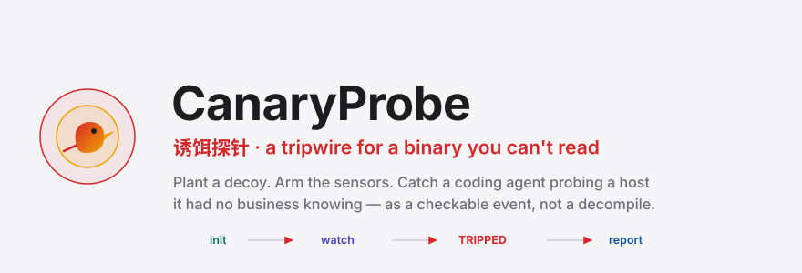
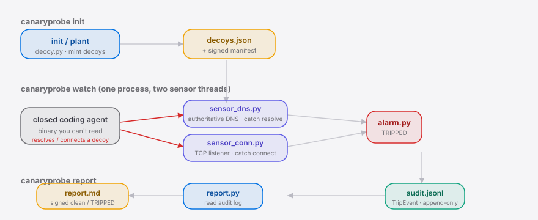
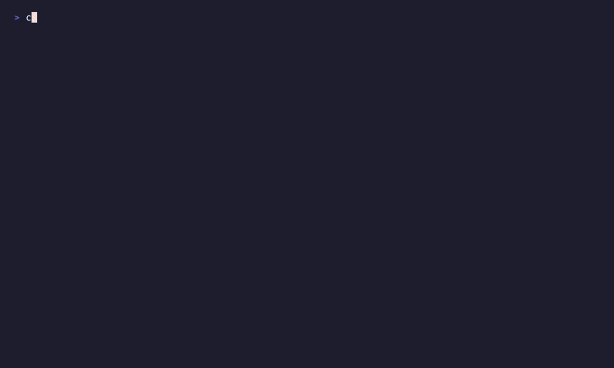

<div align="right"><sub><b>English</b>&nbsp;&nbsp;⇄&nbsp;&nbsp;<a href="./README.md">简体中文</a></sub></div>

<p align="center">
  <picture>
    <source media="(prefers-color-scheme: dark)" srcset="./assets/hero-dark.svg">
    <source media="(prefers-color-scheme: light)" srcset="./assets/hero-light.svg">
    
  </picture>
</p>

<p align="center"><sub>Plant decoy hostnames and fake credentials in the reach of a closed-source <b>coding agent</b>; the instant that binary resolves or connects one, alarm at runtime and leave an audit trail.</sub></p>

<p align="center">
  <a href="./LICENSE"></a>
  <a href="https://github.com/SuperMarioYL/canaryprobe/releases"></a>
  <a href="https://github.com/SuperMarioYL/canaryprobe/actions/workflows/ci.yml"></a>
  
  
</p>

**Turn "did this coding agent quietly phone home?" from a per-version decompilation project into a checkable yes/no event.**

CanaryProbe is a **honeytoken tripwire**: you plant a decoy hostname and a fake credential — values **no legitimate code path should ever touch** — in the reachable environment of a closed-source coding agent. The instant that unreadable binary **resolves** or **connects** one of them, the probe fires a red `TRIPPED` alarm at runtime and appends an immutable JSONL line to the audit trail.

---

## Table of Contents

- [Why this exists](#why-this-exists)
- [Architecture](#architecture)
- [Install](#install)
- [Quickstart](#quickstart)
- [Usage](#usage)
- [Demo](#demo)
- [vs Thinkst Canarytokens](#vs-thinkst-canarytokens)
- [Configuration](#configuration)
- [Pricing](#pricing)
- [Roadmap](#roadmap)
- [License](#license)

---

## Why this exists

 **Why this exists**

More and more regulated / air-gapped deployments run a closed-source **coding agent** against a local Qwen / GLM / DeepSeek endpoint (`ANTHROPIC_BASE_URL=http://localhost:...`) — the same setup the [esengine/DeepSeek-Reasonix](https://github.com/esengine/DeepSeek-Reasonix) local-model crowd runs. Compliance there demands that "no data leaves the boundary" be *demonstrated*, not assumed — yet you can't read the binary. Today the only way to find covert egress is to **decompile per version**: the r/LocalLLaMA XOR-91 teardown had to Base64-decode and XOR-decrypt (key 91) a hostname blocklist just to discover it pointed at Chinese domains.

CanaryProbe inverts that: **don't decompile — set a trap.** A decoy is a value no legitimate path ever touches, so "the binary touched a decoy" is by itself unambiguous *intent to exfiltrate*. That is exactly what separates it from an egress allow-list: an allow-list logs *traffic* and answers "is this host permitted?"; CanaryProbe answers "did the agent probe a host it had no business knowing about?"

## Architecture

 **Architecture**

A single Python package. `watch` is two sensor threads in one process — no external services, no cloud, no control plane.

<p align="center">
  <picture>
    <source media="(prefers-color-scheme: dark)" srcset="./assets/atlas-dark.svg">
    <source media="(prefers-color-scheme: light)" srcset="./assets/atlas-light.svg">
    
  </picture>
</p>

- **`sensor_dns.py`** — a tiny DNS server **authoritative only for the decoy zone**: any resolve is a trip. It answers with a loopback sinkhole so the resolve *succeeds* (the agent may then go on to *connect*, tripping the TCP sensor too).
- **`sensor_conn.py`** — a TCP listener: any connection to the decoy bind is a trip, and it peeks the first chunk so a **fake credential** the agent tries to send is recorded as the observed value.
- Both sensors are **userspace** — kernel / eBPF interception is explicitly out of scope for v0.1.

## Install

 **Install**

```bash
pip install canaryprobe
```

## Quickstart

 **Quickstart**

Three commands from cold clone to the first caught probe:

```bash
canaryprobe init          # ① mint a decoy host + fake credential + signed manifest, print what to inject
canaryprobe watch         # ② arm the DNS + TCP sensors (in a second terminal)
canaryprobe report        # ③ emit a signed clean / TRIPPED evidence artifact
```

Between `watch` and `report`, let the coding agent touch a decoy. To see the catch without a real agent, use the built-in simulator:

```bash
canaryprobe simulate-trip --sensor dns    # simulate a decoy resolve
canaryprobe simulate-trip --sensor conn   # simulate a connect that carries the fake credential
```

<details>
<summary>what watch prints when it catches a probe</summary>

```
╭──────────  TRIPPED — decoy touched  ──────────╮
│    decoy  dcy_ab12cd34                         │
│ observed  internal-prod-db-42.corp.local       │
│   sensor  DNS                                  │
│   source  127.0.0.1:60809                      │
│     time  2026-07-03T11:22:35.467097+00:00     │
╰─ a coding agent probed a host it had no busin ─╯
```

and one line lands in `audit.jsonl`:

```json
{"decoy_id":"dcy_ab12cd34","observed_value":"internal-prod-db-42.corp.local","sensor":"dns","src":"127.0.0.1:60809","ts":"2026-07-03T11:22:35.467097+00:00","verdict":"TRIPPED"}
```

</details>

## Usage

 **Usage**

Four commands cover the whole loop:

| Command | What it does |
| --- | --- |
| `canaryprobe init` | Generate a decoy set + signed manifest, print what to inject where |
| `canaryprobe plant` | Alias of `init` — re-plant a fresh decoy set |
| `canaryprobe watch` | Arm the DNS + TCP sensors; alarm + audit on a trip |
| `canaryprobe report` | Build a signed evidence artifact from the audit log |

**Put the decoy where the agent can reach it.** `init` prints exact guidance; the simplest is an `/etc/hosts` line on the agent host pointing the decoy zone at the DNS sensor:

```bash
echo "127.0.0.1   internal-prod-db-42.corp.local" | sudo tee -a /etc/hosts
export INTERNAL_API_TOKEN=cnp_…       # the fake credential init printed
canaryprobe watch                     # armed, waiting for a trip
```

**Bound the observation window** (self-exits after a fixed run — handy for batch / CI):

```bash
canaryprobe watch --duration 60       # watch for 60 seconds, then stop
```

The full 10-minute "point a real coding agent at a local endpoint and watch a decoy trip" walkthrough lives in **[`examples/local-agent-demo.md`](./examples/local-agent-demo.md)**.

## Demo

 **Demo**



## vs Thinkst Canarytokens

 **vs [Thinkst Canarytokens](https://github.com/thinkst/canarytokens)**

Canarytokens is the mature honeytoken primitive — and better than CanaryProbe on breadth of token types and hosted convenience. CanaryProbe is narrow on purpose: the target is a **closed coding-agent binary** inside an air-gapped boundary.

| | CanaryProbe | Thinkst Canarytokens |
| --- | --- | --- |
| Target surface | A closed coding-agent binary you can't read | Generic intrusion bait (docs, DNS, URLs) |
| Runtime egress sensor (authoritative DNS + TCP) | ✓ | partial (DNS token only) |
| Records the fake credential the agent tried to send | ✓ | — |
| Fully air-gapped, no callback to a cloud | ✓ | — (tokens usually beacon to a hosted server) |
| Signed local audit artifact for compliance | ✓ | partial |
| Breadth of token types | — (host + credential in v0.1) | ✓ (dozens) |

## Configuration

 **Configuration**

`init` writes a `deployment.yaml` that all three commands share, so you configure once:

| Key | Type | Default | Meaning |
| --- | --- | --- | --- |
| `decoy_zone` | string | `corp.local` | Authoritative DNS zone the decoy hosts live under |
| `dns_sensor.host` / `.port` | string / int | `127.0.0.1` / `5353` | DNS sensor bind (non-privileged, no root) |
| `conn_sensor.host` / `.port` | string / int | `127.0.0.1` / `5443` | TCP connect sensor bind |
| `decoys_file` | string | `decoys.json` | Decoy list the sensors load |
| `manifest_file` | string | `decoys.manifest.json` | Signed decoy manifest (evidence) |
| `audit_file` | string | `audit.jsonl` | Append-only audit trail |

> A per-deployment signing key (`.canaryprobe.key`, `0600`) signs the manifest and reports; inject one via `CANARYPROBE_SIGNING_KEY` to keep it off disk.

## Pricing

 **Pricing**

The OSS core (`init` / `watch` / `report`) is **free forever, with no feature paywall**. What a compliance buyer pays for is the deliverable an auditor consumes — an **on-prem / regulation-aligned audit-report edition**:

- signed, exportable "no covert egress observed over window T" evidence artifacts;
- multi-host **decoy-fleet management** across an air-gapped estate;
- deployment support.

The `report` artifact *is* the thing a compliance team buys. Buyers are air-gapped by definition, so it ships as an offline license key, not a hosted tier. Open an issue or email the maintainer to talk.

## Roadmap

 **Roadmap**

- [x] **m1 · Plant decoys** — `init` generates a decoy zone + fake credentials, writes a signed manifest, prints what to inject.
- [x] **m2 · Arm sensors** — DNS + TCP sensors run concurrently; a resolve/connect produces a `TripEvent` + red alarm + JSONL audit line.
- [x] **m3 · Emit report** — `report` builds a signed clean / TRIPPED evidence artifact from the audit log.
- [ ] Multi-host decoy-fleet management (paid edition)
- [ ] Regulation-aligned exportable audit templates (paid edition)
- [ ] More credential / decoy shapes (cloud metadata, internal package-index tokens, …)

## License

 **License**

Apache-2.0 — see [LICENSE](./LICENSE). File a bug via an [issue](https://github.com/SuperMarioYL/canaryprobe/issues) or open a PR.

## Share this

```
CanaryProbe: a honeytoken tripwire for a closed coding agent you can't read.
Plant a decoy host, and the moment the binary probes it you get a red TRIPPED
alarm + a signed audit line — a checkable event, not a decompile.
https://github.com/SuperMarioYL/canaryprobe
```

<p align="center"><sub><a href="./LICENSE">Apache-2.0</a> © 2026 SuperMarioYL</sub></p>
